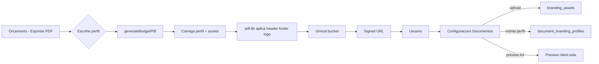

## Contexto atual

- `clinic.tenants` não tem nenhum campo de branding hoje ([database.types.ts](lib/supabase/database.types.ts)).
- Bucket `clinical` (privado, RLS por `tenant_id` no primeiro segmento) é o storage padrão ([20260407150000_clinical_storage_bucket.sql](supabase/migrations/20260407150000_clinical_storage_bucket.sql)).
- PDF de orçamento é montado em `pdf-lib` no servidor em [`generateBudgetPdf`](lib/budgets/actions.ts) — é aí que o branding precisa ser aplicado.
- Navegação em `ConfiguracoesSubnav` tem 4 abas ([configuracoes-subnav.tsx](components/configuracoes/configuracoes-subnav.tsx)).

Escopo confirmado: **só orçamento** nesta entrega, com **múltiplos perfis de branding** nomeados por clínica.

## Dimensões predefinidas (validação no upload)

Base A4 retrato (210x297 mm). Aceitar PNG/JPEG/WebP, até 4 MB, RGB.

- **Header**: proporção 8:1 a 12:1, largura mínima 1240 px (recomendado 2480x280 px). Ocupa toda a largura do papel.
- **Footer**: proporção 10:1 a 14:1, largura mínima 1240 px (recomendado 2480x240 px).
- **Logo**: quadrada (1:1) ou retangular até 3:1, largura mínima 400 px e máxima 1600 px; PNG com transparência preferencial.

As checagens ficam em um schema Zod novo em `lib/branding/schemas.ts` (tamanho, MIME, extensão, e proporção/dimensão com `probe-image-size` leve ou lendo o próprio buffer via `pdf-lib`/`sharp`? — **não**, sem nova dependência: usar decode de cabeçalho PNG/JPEG já suficiente; se complexo, validar só no client via `` e reenviar `width`/`height`).

## Modelo de dados (nova migration)

Arquivo: `supabase/migrations/2026MMDDHHMMSS_clinic_branding.sql` (schema `clinic`, RLS por `tenant_id` como demais tabelas).

- `clinic.branding_assets`
  - `id uuid pk default gen_random_uuid()`
  - `tenant_id uuid not null references clinic.tenants(id) on delete cascade`
  - `kind text not null check (kind in ('header','footer','logo'))`
  - `label text` (rótulo dado pelo usuário)
  - `storage_key text not null` (path no bucket `clinical`)
  - `mime_type text not null`
  - `width_px int`, `height_px int`, `file_size int`
  - `created_at/updated_at timestamptz`
  - Índice em `(tenant_id, kind)`.
- `clinic.document_branding_profiles`
  - `id uuid pk`, `tenant_id uuid not null fk`
  - `name text not null`, `is_default boolean not null default false`
  - `show_header bool`, `show_footer bool`, `show_logo bool`
  - `header_asset_id uuid fk branding_assets`, `footer_asset_id uuid fk`, `logo_asset_id uuid fk`
  - `logo_position text check in ('top-left','top-center','top-right','below-header-left','below-header-center')`
  - `logo_scale_pct int check between 10 and 100 default 30`
  - `header_height_mm int default 30`, `footer_height_mm int default 20`
  - `margin_top_mm int`, `margin_right_mm`, `margin_bottom_mm`, `margin_left_mm`
  - `created_at/updated_at`
  - Índice único parcial `(tenant_id) where is_default` para garantir no máximo 1 padrão por clínica.
- **RLS** nas duas tabelas: `select/insert/update/delete` limitados a `tenant_id = (select tenant_id from clinic.profiles where id = auth.uid())`, no mesmo padrão das migrations existentes.
- **Regenerar** `lib/supabase/database.types.ts` após aplicar.

## Storage

Caminho no bucket `clinical`: `{tenantId}/branding/{kind}/{uuid}.{ext}`. A RLS existente já autoriza (primeiro segmento é o `tenant_id`). Ao trocar o asset referenciado em um perfil, a action apaga o objeto antigo (mesmo padrão de [`professional-asset-actions.ts`](lib/profiles/professional-asset-actions.ts)).

## Camada de server (novo módulo)

Criar `lib/branding/` com:

- `schemas.ts` — Zod para upload, criação/edição de perfil, dimensões aceitas por `kind`.
- `actions.ts` — server actions autenticadas via `requireClinicalTenantContext()`:
  - `uploadBrandingAsset({ kind, file, label })`
  - `deleteBrandingAsset(assetId)`
  - `createBrandingProfile(input)`, `updateBrandingProfile`, `duplicateBrandingProfile`, `deleteBrandingProfile`, `setDefaultBrandingProfile(profileId)` (usa transação leve: `update ... is_default = false where tenant_id = $1` + `update target`).
  - `listBrandingAssets()`, `listBrandingProfiles()`, `getBrandingProfileWithAssets(profileId)` (com signed URLs dos assets pra preview).
- `apply-to-pdf.ts` — helper puro que recebe `PDFDocument` + `profile` + bytes dos assets e aplica header/footer/logo em cada página (`page.drawImage`), respeitando margens e posição.

## UI — nova seção Configurações → Documentos

1. Adicionar item `"Documentos"` em [configuracoes-subnav.tsx](components/configuracoes/configuracoes-subnav.tsx):

```tsx
{ href: "/configuracoes/documentos", label: "Documentos" },
```

2. Nova rota `app/(dashboard)/configuracoes/documentos/page.tsx` (server component): carrega assets + perfis do tenant e passa ao client manager.

3. Novo `components/configuracoes/document-branding-manager.tsx` (client):
   - Painel **Imagens da marca**: três slots (Header, Footer, Logo) com uploader, requisitos visíveis (proporção e tamanho mínimo), lista de imagens já enviadas e ação de excluir.
   - Painel **Perfis de documento**: lista de perfis; cada card tem nome, toggles (`show_header`, `show_footer`, `show_logo`), selects dos assets, posição do logo, escala, margens; botão "Tornar padrão", "Duplicar", "Excluir".
   - **Preview A4 ao vivo** (`components/configuracoes/document-preview-a4.tsx`): `div` com aspect `210/297`, renderiza `` dos assets selecionados nos slots corretos com as mesmas fórmulas (mm→%) usadas no servidor. Exibe um "lorem ipsum" no corpo para dar noção de margem.
   - Mutations via server actions + `useTransition`; feedback com `sonner`/toast já existente no projeto; `router.refresh()` após cada ação.

4. Novo `components/ui/dropzone-upload.tsx` só se não existir reaproveitável; caso contrário reutilizar padrão do `professional-assets-form.tsx`.

## Integração no orçamento

- Estender [`generateBudgetPdf`](lib/budgets/actions.ts) para aceitar `brandingProfileId?: string`. Se não vier, buscar o `is_default = true` do tenant. Se nenhum existir, gerar PDF atual (fallback sem branding).
- Antes do `drawText` do título, carregar perfil + assets (`download` do storage → `doc.embedPng/Jpg`), calcular `headerBox`/`footerBox` em pontos (1 mm = 2.8346 pt) e desenhar em cada página.
- Ajustar `y` inicial do conteúdo para respeitar `margin_top_mm` + `header_height_mm`, e o rodapé limita `y` mínimo. Quebra de página simples (iterar `items`, criar novo `page` quando `y < footerLimit`).
- UI em [`budgets-manager.tsx`](components/budgets/budgets-manager.tsx): substituir o botão "Exportar PDF" por um `DropdownMenu` com a lista de perfis do tenant ("Usar padrão" no topo). Adicionar `listBrandingProfiles()` ao load inicial do server component em [orcamentos/page.tsx](app/(dashboard)/orcamentos/page.tsx) e passar como prop.

## Fluxo resumido



## Segurança e multitenant

- Todas as tabelas novas com RLS por `tenant_id` via `clinic.profiles`.
- Server actions sempre via `requireClinicalTenantContext()`; nunca aceitar `tenantId` vindo do client.
- Storage continua no bucket `clinical` com RLS já existente (primeiro segmento = `tenant_id`).
- Validação Zod server-side de tamanho/MIME; sanitização de `label`/`name` com `.trim()` + `max(...)`.

## Typecheck & commit

Após implementar: `npm run typecheck`. Commits separados: (1) migration + types, (2) módulo `lib/branding`, (3) UI de configurações, (4) integração no orçamento.

## Fora do escopo (explícito)

- Contratos HTML e anamnese **não** recebem branding agora (confirmado `only_budget`).
- Sem pipeline HTML→PDF novo.
- Sem dependência nova; usamos `pdf-lib` já instalado.
