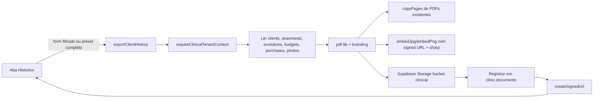

## 1. Card "Orçamentos em aberto" na home

Hoje [app/(dashboard)/inicio/page.tsx](app/(dashboard)/inicio/page.tsx) mostra valor fixo `"—"` com hint "Em breve". Alterar para:

- Adicionar uma terceira query paralela no `Promise.all`:
  ```ts
  supabase.schema("clinic").from("budgets")
    .select("id", { count: "exact", head: true })
    .eq("tenant_id", tenantId)
    .in("status", ["draft", "sent"])
  ```
- Trocar o `StatCard` fixo por um clicável (wrapper `<Link href="/orcamentos">`). O `StatCard` atual (`components/dashboard/stat-card.tsx`) precisa aceitar prop `href` opcional; se já não aceita, adiciono essa prop (ou envolvo com `<Link>` por fora).
- `hint` dinâmico: `"X rascunho · Y enviados"` caso `count > 0`, senão `"Nenhum em aberto"`.

Não toco em tipos; `budgets.status` já é `string` em [lib/supabase/database.types.ts](lib/supabase/database.types.ts).

## 2. Cancelamento automático de orçamentos vencidos (pg_cron)

Regra confirmada: apenas `status = 'sent'` com `valid_until < CURRENT_DATE` vira `'cancelled'`. Rascunhos e aprovados ficam intactos.

Nova migration `supabase/migrations/2026MMDD_budgets_auto_cancel.sql`:

- `create extension if not exists pg_cron;` (já costuma estar habilitado no Supabase, é idempotente).
- Adicionar coluna auxiliar para rastrear a origem:
  ```sql
  alter table clinic.budgets
    add column if not exists cancelled_at timestamptz,
    add column if not exists cancellation_reason text;
  ```
- Função SQL idempotente e `security definer`:
  ```sql
  create or replace function clinic.expire_sent_budgets()
  returns integer language plpgsql security definer as $$
  declare
    v_count int;
  begin
    update clinic.budgets
       set status = 'cancelled',
           cancelled_at = now(),
           cancellation_reason = 'auto_expired',
           updated_at = now()
     where status = 'sent'
       and valid_until is not null
       and valid_until < current_date;
    get diagnostics v_count = row_count;
    return v_count;
  end $$;
  ```
- Agendar diariamente:
  ```sql
  select cron.schedule(
    'clinic-expire-sent-budgets',
    '15 3 * * *',
    $$ select clinic.expire_sent_budgets(); $$
  );
  ```

Ajustes no app:

- [lib/budgets/actions.ts](lib/budgets/actions.ts) → `budgetStatusLabel` continua igual, mas na listagem (`listBudgets` ou equivalente) incluir o novo campo `cancellation_reason` quando for útil exibir "Cancelado automaticamente (vencido em dd/mm)".
- [components/budgets/budgets-manager.tsx](components/budgets/budgets-manager.tsx) → badge de cancelados ganha tooltip quando `cancellation_reason === 'auto_expired'`.
- Regenerar [lib/supabase/database.types.ts](lib/supabase/database.types.ts) após a migration.

## 3. Aba "Histórico" e exportação em PDF único

### 3.1 Navegação

- [components/clients/paciente-ficha-nav.tsx](components/clients/paciente-ficha-nav.tsx) → adicionar item **Histórico** (entre "Financeiro" e "Anexos"), apontando para `/pacientes/[clientId]/historico`.
- Nova rota `app/(dashboard)/pacientes/[clientId]/historico/page.tsx` (server component) que carrega contadores por seção e renderiza o componente de exportação.
- Nova rota `app/(dashboard)/pacientes/[clientId]/fotos/page.tsx` já existe mas não está no subnav — aproveitar para incluir também, fora do escopo direto da task caso o usuário não queira.

### 3.2 UI do painel

Novo `components/clients/paciente-historico-panel.tsx` (client component) com:

- **Cabeçalho**: preset "Exportação completa" (um clique, ativa tudo) e "Exportação filtrada" (abre formulário).
- **Formulário** (React Hook Form + Zod):
  - Período: `de` / `até` (opcionais).
  - Checkboxes por seção: Dados cadastrais, Observações, Anamneses, Evoluções, Orçamentos, Contratos/Compras, Fotos.
  - Perfil de branding (reutiliza seletor de [components/budgets/budgets-manager.tsx](components/budgets/budgets-manager.tsx)).
  - Switches: `Incluir fotos em alta resolução`, `Mesclar PDFs originais` (anexa anamneses/contratos assinados já existentes).
- **Botão "Gerar PDF"**: chama server action, exibe progresso e abre signed URL em nova aba.
- **Lista de histórico** abaixo do formulário: últimas exportações geradas (lidas de `clinic.documents` com `kind = 'client_history_export'`), com botão para rebaixar.

### 3.3 Server action

Novo arquivo [lib/clients/history-export.ts](lib/clients/history-export.ts) com `exportClientHistory(input)`:

1. `requireClinicalTenantContext()` para validar tenant/RLS.
2. Coletar dados do cliente conforme filtros (respeitando `created_at BETWEEN` quando aplicável) a partir de: `clients`, `anamnesis_forms`, `anamnesis_submissions` (+ `flattened_pdf_url` quando existir), `evolutions`, `budgets`+`budget_items`, `client_procedure_purchases` (+ `contract_document_id`), `photos`.
3. Construir PDF A4 com `pdf-lib`, reutilizando `resolveBrandingForPdf` e `drawBrandingOnPage` de [lib/branding/apply-to-pdf.ts](lib/branding/apply-to-pdf.ts).
4. Estrutura do documento:
   - Capa: logo (via branding), nome do paciente, período, data de geração.
   - Seção "Dados cadastrais" (nome, documento, contato, responsável etc.).
   - Seção "Observações" (`clients.notes`).
   - Seção "Anamneses": para submissions interativas baixar o `flattened_pdf_url` via storage e `copyPages` para anexar; para `anamnesis_forms` (JSON), renderizar campos em texto.
   - Seção "Evoluções": lista cronológica (data + profissional + conteúdo).
   - Seção "Orçamentos": tabela resumo (data, título, status, total) + opcionalmente mesclar PDFs já gerados.
   - Seção "Contratos / Compras": itens de `client_procedure_purchases` e, quando marcado, merge do PDF do `contract_document_id`.
   - Seção "Fotos": grid 2×2 por página, `embedJpg`/`embedPng` com download prévio do bucket `clinical` por `createSignedUrl` e `fetch`. Redimensionamento server-side via `sharp` (já disponível no Next) para não estourar memória quando a opção "alta resolução" estiver desligada.
5. Salvar o PDF em `clinical` no path `${tenantId}/${clientId}/exports/historico-${Date.now()}.pdf`, registrar em `clinic.documents` (kind `client_history_export`, vínculo `client_id`), retornar signed URL.
6. Auditoria mínima: log com `tenantId`, `clientId`, seções selecionadas, tamanho do arquivo (sem dados clínicos).

### 3.4 Zod + tipos

Novo `lib/clients/history-export.schemas.ts`:

```ts
export const historyExportSchema = z.object({
  clientId: z.string().uuid(),
  from: z.string().date().optional(),
  to: z.string().date().optional(),
  sections: z.object({
    profile: z.boolean(),
    notes: z.boolean(),
    anamnesis: z.boolean(),
    evolution: z.boolean(),
    budgets: z.boolean(),
    contracts: z.boolean(),
    photos: z.boolean(),
  }),
  mergeOriginalPdfs: z.boolean().default(true),
  highResPhotos: z.boolean().default(false),
  brandingProfileId: z.string().uuid().nullable().optional(),
});
```

### 3.5 Fluxo em diagrama



## 4. Verificação

- `pnpm typecheck` (ou `npm run typecheck`) após cada etapa.
- Testar migration em branch: `supabase db push` + conferir `cron.job`.
- Smoke manual: criar budget sent com `valid_until` no passado, rodar `select clinic.expire_sent_budgets();`, confirmar update.
- Smoke export: paciente com anamnese, evolução, foto e orçamento, gerar PDF completo e PDF filtrado.
