## Diagnóstico consolidado

- TanStack Query está instalado (`@tanstack/react-query@5.94.5`) e o `QueryProvider` já é montado em [app/layout.tsx](app/layout.tsx), mas **nenhuma tela usa `useQuery`/`useMutation`**. Toda a navegação hoje depende de RSC + `revalidatePath` + `router.refresh()`, que é caro e pisca a tela.
- Não há biblioteca de toast instalada. Feedback de salvamento é inline ad-hoc em cada formulário; ações destrutivas usam `confirm()` nativo; há inclusive um `alert()` em `components/stock/procedures-panel.tsx`. Erros do Supabase vazam crus em vários pontos.
- Nenhuma rota tem `loading.tsx`/`error.tsx`. Agenda e config/agenda usam `force-dynamic`, o que impede qualquer cache.
- `clinic.appointments` tem `starts_at`, `ends_at`, `status`, `client_id`, `procedure_id`, com join de nome via [lib/agenda/mapper.ts](lib/agenda/mapper.ts). Realtime já existe, mas **só dentro** de [components/agenda/agenda-calendar.tsx](components/agenda/agenda-calendar.tsx) — não há qualquer alerta quando a usuária está em outra tela.
- Tokens de cor são fixos em `:root` de [app/globals.css](app/globals.css) (sálvia/papel); não há dark mode, nem preferência de tema por usuário, nem default por tenant. `tailwind.config.ts` ainda não habilita `darkMode: "class"`. Não existe rota de perfil do usuário — trocar senha hoje só via fluxo de reset por e-mail.

```mermaid
flowchart LR
    subgraph fase1 [Fase 1 Feedback]
        sonner[Toaster sonner]
        confirmDialog[ConfirmDialog compartilhado]
        errorMap[Humanizador de erros Supabase]
    end
    subgraph fase2 [Fase 2 Alerta Agenda]
        provider[AgendaNotificationsProvider]
        realtime[Realtime global appointments]
        scheduler[Timer marcos 15min e 0min]
    end
    subgraph fase3 [Fase 3 Cache e Navegacao]
        tanstack[TanStack Query nas listas cliente]
        hydration[HydrationBoundary RSC -> client]
        loading[loading.tsx e skeletons]
        optimistic[Mutacoes otimistas]
    end
    subgraph fase4 [Fase 4 Perfil e Tema]
        schema[DB tenant default e user override]
        tokens[Tokens por preset e dark mode]
        perfil[Rota configuracoes perfil]
        senha[Trocar senha Supabase Auth]
    end
    fase1 --> fase2 --> fase3 --> fase4
```



---

## Fase 1 — Feedback de operações (base para tudo)

### Dependência nova
- `sonner` (toast leve, estilo shadcn, compatível com Next 15). Adicionar via `npm i sonner`.

### Novos arquivos
- `components/ui/toaster.tsx` — wrapper do `<Toaster />` do sonner com `position="top-right"`, `richColors`, classes alinhadas aos tokens (`--brand`, `--surface`, `--border`).
- `components/ui/confirm-dialog.tsx` — modal acessível (Radix Dialog já presente via shadcn pattern) para substituir `window.confirm(...)`. Aceita `title`, `description`, `confirmLabel`, `destructive?: boolean` e `onConfirm: () => Promise<void>` com estado `pending`.
- `lib/ui/notify.ts` — helpers tipados:
  ```ts
  notifySuccess(msg: string, opts?)
  notifyError(err: unknown, fallback?: string)
  notifyInfo(msg: string)
  notifyPromise<T>(p: Promise<T>, labels)
  ```
- `lib/ui/humanize-error.ts` — mapeia códigos Postgres/Supabase (`23505` duplicata, `23503` FK, `42501` RLS/permissão, `PGRST116` não encontrado, mensagens de storage) para texto em PT-BR. Fallback: "Não foi possível completar a operação. Tente novamente.". `notifyError` usa esse mapa.

### Integração pontual
- [app/layout.tsx](app/layout.tsx): montar `<Toaster />` dentro do `<QueryProvider>`, antes de `{children}`.
- Substituir inline messages e `confirm()` em ordem de impacto:
  1. [components/agenda/appointment-dialog.tsx](components/agenda/appointment-dialog.tsx) — criar/editar/excluir agendamento.
  2. [components/clients/novo-paciente-wizard.tsx](components/clients/novo-paciente-wizard.tsx), [components/clients/paciente-cadastro-form.tsx](components/clients/paciente-cadastro-form.tsx), [components/clients/paciente-dados-editor.tsx](components/clients/paciente-dados-editor.tsx).
  3. [components/clients/paciente-evolucao-panel.tsx](components/clients/paciente-evolucao-panel.tsx), [components/clients/paciente-documentos-panel.tsx](components/clients/paciente-documentos-panel.tsx) — trocar `confirm()` por `ConfirmDialog`.
  4. [components/sales/new-sale-wizard.tsx](components/sales/new-sale-wizard.tsx), [components/budgets/budgets-manager.tsx](components/budgets/budgets-manager.tsx).
  5. [components/stock/procedures-panel.tsx](components/stock/procedures-panel.tsx) — remover o `alert()` e usar `notifyError`.
  6. [components/anamnesis/templates-manager.tsx](components/anamnesis/templates-manager.tsx), [components/anamnesis/anamnesis-submissions-panel.tsx](components/anamnesis/anamnesis-submissions-panel.tsx), [components/configuracoes/agenda-config-panel.tsx](components/configuracoes/agenda-config-panel.tsx), [components/configuracoes/professional-assets-form.tsx](components/configuracoes/professional-assets-form.tsx), [components/configuracoes/contract-templates-manager.tsx](components/configuracoes/contract-templates-manager.tsx).
- Padrão unificado de botão submit: `disabled + "Salvando..." + icone animate-spin` em [components/ui/button.tsx](components/ui/button.tsx) via nova variante `loading?: boolean`.

### Critério de pronto Fase 1
- Todo salvamento relevante dispara `notifySuccess`/`notifyError`. Todo `confirm()` nativo foi substituído. Nenhum erro Supabase cru na UI.

---

## Fase 2 — Alerta in-app de proximidade de agendamento

Marcos acordados: **15 min antes** e **no horário**. Só in-app (toast persistente + banner sticky), sem Notification API nem push.

### Novos arquivos
- `lib/agenda/upcoming.ts`
  - `fetchUpcomingAppointments(supabase, tenantId, windowMinutes = 120)` — seleciona appointments com `starts_at BETWEEN now() - 5min AND now() + windowMinutes` e `status NOT IN ('canceled','no_show','completed')`.
  - `computeNextMilestone(appt, now)` — retorna `"t-15" | "t-0" | null` com tolerância `±30s`.
- `app/api/agenda/upcoming/route.ts` — GET que reaproveita `fetchUpcomingAppointments` com `getAuthContext()`. Não é crítico (fallback: Realtime faz quase todo o trabalho).
- `components/agenda/agenda-notifications-provider.tsx` (client):
  - Carrega próximos agendamentos no mount (via API acima, ou receber `initialUpcoming` do layout).
  - Abre canal Realtime `channel("agenda-notify:${tenantId}")` em `clinic.appointments` filtrado por `tenant_id` e atualiza a lista.
  - Mantém `setInterval(check, 30_000)` chamando `computeNextMilestone` para cada appointment; quando acerta um marco, dispara `notifyInfo` com CTA "Abrir agenda" + atualiza o banner global.
  - `Set<string>` de `"${id}:${milestone}"` persistido em `sessionStorage` para não repetir o mesmo toast na mesma aba.
  - Context expõe `upcoming, nextAppointment` para o banner.
- `components/agenda/next-appointment-banner.tsx` (client): banner sticky renderizado no topo do `main` quando há agendamento nos próximos 60 min. Mostra "Em 14 min — Maria Silva — Limpeza de pele — sala 2", cor muda no marco T-0, botão "Ver agenda" (`Link href="/agenda"`). Esconde se não há próximo ou se `status === 'canceled'`.

### Integrações
- [app/(dashboard)/layout.tsx](app/(dashboard)/layout.tsx): para `variant === "clinic"`, carregar server-side os `initialUpcoming` e envolver `AppShell` com `<AgendaNotificationsProvider initialUpcoming={...} tenantId={...}>`.
- [components/layout/app-shell.tsx](components/layout/app-shell.tsx): adicionar slot acima de `<main>` para `<NextAppointmentBanner />` (sticky, altura ~40px, usa tokens já existentes).

### Edge cases cobertos
- Appointment movido/cancelado via Realtime: banner e lista recalculam imediatamente.
- Aba inativa: `setInterval` de 30s é suficiente pois fuso é `America/Sao_Paulo` com tolerância. Quando a aba volta ao foco, `visibilitychange` força um recheck.
- Dois marcos muito próximos: `Set` de marcos já disparados evita duplicação.

### Critério de pronto Fase 2
- Em qualquer tela do dashboard, 15 min antes e no horário aparece toast + banner. Mudanças na agenda refletem em tempo real sem precisar sair da tela.

---

## Fase 3 — Cache e navegação fluida

### 3a. Ativar TanStack Query de verdade
- Evoluir `components/providers/query-provider.tsx`:
  - `staleTime: 30_000`, `gcTime: 5 * 60_000`, `refetchOnWindowFocus: "always"` para dados operacionais, `retry: 1`.
  - Adicionar `<HydrationBoundary state={dehydratedState}>` suportando injeção de estado a partir de RSC.
- Criar `lib/query/keys.ts` — query keys centralizadas por domínio (`appointments`, `clients`, `sales`, `budgets`, `procedures`, `products`, `platform.clinics`, `platform.users`).
- Migrar para `useQuery` as **listas de cliente** que hoje fazem `fetch` em `useEffect`:
  - [components/agenda/agenda-calendar.tsx](components/agenda/agenda-calendar.tsx) — trocar `useEffect + fetch /api/agenda/appointments` por `useQuery({ queryKey: keys.appointments(range), queryFn, initialData: initialAppointments, staleTime: 15_000 })`. Realtime invalida via `queryClient.invalidateQueries`.
  - [components/plataforma/platform-clinics-panel.tsx](components/plataforma/platform-clinics-panel.tsx) e [components/plataforma/platform-users-panel.tsx](components/plataforma/platform-users-panel.tsx).
- Migrar mutações críticas para `useMutation` com `onMutate` otimista + `onSettled` que invalida as keys certas:
  - Criar/editar/deletar appointment (já via `/api/agenda/appointments/*`).
  - Convidar agente em `components/equipe/invite-agent-form.tsx`.
  - Criar/arquivar clínica e usuário em plataforma.

### 3b. Prefetch e hydration RSC → Client
Para as listas grandes que seguem RSC (pacientes, vendas, orçamentos):
- Em cada `page.tsx` RSC, manter a query Supabase mas além de passar dados como prop, usar `dehydrate(queryClient)` para popular o cache client. Exemplo em [app/(dashboard)/pacientes/page.tsx](app/(dashboard)/pacientes/page.tsx).
- Permite que, ao voltar para a lista, a transição seja instantânea (cache warm) enquanto o refetch acontece em background.

### 3c. `loading.tsx` + skeletons por rota
Novos arquivos:
- `app/(dashboard)/agenda/loading.tsx` — esqueleto do calendário (grid de dias + linhas).
- `app/(dashboard)/pacientes/loading.tsx` — 8 linhas skeleton.
- `app/(dashboard)/pacientes/[clientId]/loading.tsx` — header + tabs skeleton.
- `app/(dashboard)/vendas/loading.tsx`, `orcamentos/loading.tsx`, `estoque/loading.tsx`, `inicio/loading.tsx`.
- `app/(dashboard)/error.tsx` — boundary com botão "Tentar de novo" chamando `reset()`.
- `components/ui/skeleton.tsx` — primitivo reutilizável.

### 3d. Remover bloqueios e afinar revalidação
- Reavaliar `export const dynamic = "force-dynamic"` em [app/(dashboard)/agenda/page.tsx](app/(dashboard)/agenda/page.tsx) e [app/(dashboard)/configuracoes/agenda/page.tsx](app/(dashboard)/configuracoes/agenda/page.tsx). Manter só onde cookies/auth forçarem; para o resto, usar `revalidate = 0` implícito + cache de client via TanStack.
- Em `lib/agenda/actions.ts`, adicionar `revalidatePath("/agenda", "page")` e `revalidatePath("/inicio", "page")` pós-mutação para alinhar com o que já faz o resto das actions.
- Substituir `router.refresh()` manual em formulários migrados para `useMutation` por `queryClient.invalidateQueries({ queryKey: keys.xxx })`, evitando re-SSR.

### 3e. Micro-transições de navegação
- Adicionar `app/(dashboard)/template.tsx` com fade-in curto (CSS puro, 120 ms) para suavizar transição de rota quando o cache está frio.
- Prefetch já é padrão no `next/link`; só garantir que `ClinicNav` use `<Link>` (já usa).

### Critério de pronto Fase 3
- Listas voltam instantâneas (cache quente) e atualizam em background.
- Mutações em agenda e plataforma não "piscam" a tela.
- Todas as rotas do dashboard têm skeleton enquanto carregam.
- Nenhum `force-dynamic` desnecessário sobrou.

---

## Fase 4 — Perfil do usuário, dark mode e paletas

Decisões acordadas:
- **Clínica define o default** (admin/owner em `Configurações > Aparência`), **cada usuário pode sobrescrever** no próprio perfil.
- **Presets fixos** de cor de destaque + **modo independente** (`light` / `dark` / `system`). Nada de color picker livre (evita problemas de contraste).
- Escopo de persistência: preferência do usuário é **por profile**, e como `profiles` já é `tenant_id`-scoped, ela naturalmente é "por usuário naquela clínica".

### 4.1 Paletas padrão (presets)

Nome interno (ASCII) e uso:

- `salvia` — default histórico (verde-sálvia atual, mantém identidade).
- `indigo`, `azul`, `roxo`, `rosa`, `laranja`, `verde-agua`, `grafite` — 7 alternativas.

Cada preset define apenas os tokens **de destaque** e seus pares em light/dark:
`--brand`, `--brand-hover`, `--brand-soft`, `--brand-container`, `--ring`, `--shadow-lift` (tingida levemente pela brand). Os tokens estruturais (`--canvas`, `--surface`, `--muted`, `--foreground*`, `--border`) são definidos por **modo** (light/dark), não por preset.

### 4.2 Modelo de dados (nova migração)

Arquivo: `supabase/migrations/20260420120000_user_theme_preferences.sql`

- Em `clinic.profiles` (já existente), adicionar:
  - `theme_accent_preset text null check (theme_accent_preset in ('salvia','indigo','azul','roxo','rosa','laranja','verde-agua','grafite'))`
  - `theme_mode text null check (theme_mode in ('light','dark','system'))`
  - Ambas **nullable** — `null` significa "herdar do default da clínica".
- Nova tabela `clinic.clinic_theme_settings`:
  ```sql
  create table clinic.clinic_theme_settings (
    tenant_id uuid primary key references clinic.tenants(id) on delete cascade,
    default_accent_preset text not null default 'salvia'
      check (default_accent_preset in (...)),
    default_mode text not null default 'light'
      check (default_mode in ('light','dark','system')),
    updated_at timestamptz not null default now(),
    updated_by_profile_id uuid references clinic.profiles(id)
  );
  ```
- RLS:
  - `profiles`: políticas existentes cobrem `UPDATE` do próprio profile; garantir que as 2 novas colunas estão no `grant update` aplicável. O usuário só pode editar o próprio registro.
  - `clinic_theme_settings`: `SELECT` para qualquer profile do tenant (todos precisam ler o default para renderizar). `INSERT`/`UPDATE` somente para `tenant_managers` (owner/clinic_admin) — reusar `is_tenant_manager(tenant_id)` já existente na migração de manager.
- Atualizar [lib/supabase/database.types.ts](lib/supabase/database.types.ts) após aplicar a migração (ou rodar o gerador).

### 4.3 Tokens e dark mode no CSS

Refatorar [app/globals.css](app/globals.css):

```css
:root {
  /* estruturais LIGHT (default) */
  --canvas: #fbf9f6;
  --surface: #fffefb;
  --muted: #f5f3f0;
  --foreground: #1b1c1a;
  --foreground-muted: #5e5f5c;
  --foreground-subtle: #78716c;
  --border: rgba(28, 25, 23, 0.07);
  --destructive: #b91c1c;
  --radius-lg: 0.875rem; --radius-md: 0.625rem; --radius-sm: 0.375rem;
  --font-sans: "DM Sans", ui-sans-serif, system-ui, sans-serif;
}

html.dark {
  --canvas: #111312;
  --surface: #181b1a;
  --muted: #1f2322;
  --foreground: #f3f2ee;
  --foreground-muted: #c8c8c3;
  --foreground-subtle: #9a9a94;
  --border: rgba(245, 243, 239, 0.08);
  --destructive: #f87171;
}

/* Presets de destaque — valem em light e dark simultaneamente */
:root[data-accent="salvia"] {
  --brand: #4a655a; --brand-hover: #3d564c;
  --brand-soft: rgba(74,101,90,0.09); --brand-container: #cbe9db;
  --ring: rgba(74,101,90,0.28);
}
html.dark[data-accent="salvia"] {
  --brand: #8fbea5; --brand-hover: #a3cdb6;
  --brand-soft: rgba(143,190,165,0.12); --brand-container: #2e4a3e;
  --ring: rgba(143,190,165,0.35);
}
/* repetir para indigo, azul, roxo, rosa, laranja, verde-agua, grafite (light+dark) */
```

Em [tailwind.config.ts](tailwind.config.ts) habilitar `darkMode: "class"`. As utilidades existentes (`bg-canvas`, `text-ink`, etc.) já leem as CSS vars, então **não muda** o uso nos componentes; muda apenas a origem dos valores.

### 4.4 Script anti-FOUC

Novo `components/theme/theme-early-script.tsx` que exporta um `<script dangerouslySetInnerHTML>` para injetar no `<head>` de [app/layout.tsx](app/layout.tsx). Lógica:

1. Lê cookie `clinic-theme` (setado pelo server) com `{mode, accent}` resolvidos.
2. Fallback: lê `localStorage.clinic-theme`.
3. Fallback: usa `matchMedia('(prefers-color-scheme: dark)')` se modo for `system`.
4. Aplica `document.documentElement.classList.toggle('dark', ...)` e `setAttribute('data-accent', accent)` **antes** do React hidratar.

Cookie é escrito pelo `ThemeProvider` após load e por server actions de update.

### 4.5 Provider e ações

- `lib/theme/presets.ts` — lista canônica dos presets com label, swatch hex, descrição.
- `lib/theme/actions.ts` (server actions):
  - `updateMyTheme({ mode, accent })` — atualiza `clinic.profiles` do usuário logado; grava cookie `clinic-theme` via `cookies().set`.
  - `updateClinicDefaultTheme({ mode, accent })` — exige `isTenantManager`; upsert em `clinic.clinic_theme_settings`.
  - `updateMyPassword({ currentPassword, newPassword })` — re-autentica via `signInWithPassword` para validar senha atual, depois `supabase.auth.updateUser({ password })`. Retorna erro humanizado.
- `lib/theme/resolve.ts` (server):
  - `resolveTheme(supabase, profile)` → `{ mode, accent, source: "user" | "clinic" | "fallback" }`. Regra: user override > clinic default > `salvia` + `light`.
- `components/theme/theme-provider.tsx` (client):
  - Contexto com `mode, accent, source`, setters que chamam as server actions otimisticamente (atualiza `classList` e `data-accent` imediatamente, rollback em caso de erro + `notifyError`).
- Integração em [app/(dashboard)/layout.tsx](app/(dashboard)/layout.tsx): chamar `resolveTheme` e envolver `AppShell` com `<ThemeProvider initial={resolved}>`. O cookie é reescrito para manter anti-FOUC consistente.

### 4.6 UI — área de perfil

Nova rota `app/(dashboard)/configuracoes/perfil/page.tsx` (RSC que carrega profile + resolved theme), com sub-componentes client:

- `components/profile/profile-identity-card.tsx` — nome completo (edita em `profiles.full_name`) e e-mail (read-only, informa "use suporte para alterar").
- `components/profile/change-password-form.tsx` — RHF + Zod (`currentPassword`, `newPassword` ≥ 8 chars + confirmação). Usa `updateMyPassword` e dispara `notifySuccess`.
- `components/profile/theme-selector.tsx`:
  - Grupo 1 — Modo: 3 cards (Claro / Escuro / Seguir sistema) com preview mini.
  - Grupo 2 — Paleta: grid de swatches (8 presets) com nome e ponto circular colorido; indica qual é o "padrão da clínica" com selo.
  - Botão "Usar padrão da clínica" que envia `{ mode: null, accent: null }` para voltar a herdar.
- Nova rota `app/(dashboard)/configuracoes/aparencia/page.tsx` — **apenas** para `isTenantManager`; mesmo `theme-selector` mas chamando `updateClinicDefaultTheme`. Se usuário não-manager entrar, `notFound()`.
- Adicionar itens no [components/configuracoes/configuracoes-subnav.tsx](components/configuracoes/configuracoes-subnav.tsx): "Meu perfil" (todos) e "Aparência" (só managers, condicional com prop).

### 4.7 Atalho visual no AppShell

Em [components/layout/app-shell.tsx](components/layout/app-shell.tsx), no rodapé da sidebar (ou ao lado do e-mail), adicionar um toggle rápido de **modo** (sol/lua/monitor) que chama `updateMyTheme({ mode })` sem sair da tela. Acesso visual para o usuário trocar rapidinho sem navegar.

### Critério de pronto Fase 4
- Migração aplicada com RLS; `database.types.ts` atualizado.
- Qualquer usuário consegue alternar dark/light e trocar paleta em `/configuracoes/perfil`, com efeito instantâneo e sem FOUC ao recarregar.
- Admin/owner consegue definir default da clínica em `/configuracoes/aparencia`; usuários que não sobrescreveram veem esse default imediatamente (após próximo load/soft-refresh).
- Senha do próprio usuário é trocável pela UI, validando a senha atual.
- `npm run typecheck` verde; sem erros no console referentes a classe `.dark` ou `data-accent`.

---

## O que ainda falta para "profissional" além das 4 fases (backlog sugerido, fora do escopo atual)

- Estados vazios com CTA em todas as listas (`EmptyState` compartilhado).
- Autosave em [components/anamnesis/desktop-anamnesis-editor.tsx](components/anamnesis/desktop-anamnesis-editor.tsx) e evolução (rascunho local a cada 10s).
- Observabilidade: logger cliente (`lib/log/client.ts`) enviando erros para endpoint próprio ou Sentry.
- Atalhos de teclado globais: `g a` agenda, `g p` pacientes, `n` novo agendamento.
- Paginação e busca indexada em pacientes (hoje carrega todos).
- Breadcrumbs no topo do `main` e `<title>` dinâmico por rota.

## Riscos e mitigações

- Realtime duplicado (calendar + provider) no mesmo tenant: usar nomes de canal distintos (`appointments:${tenantId}` e `agenda-notify:${tenantId}`) — já previsto.
- Sessão expirando em tab aberta por horas: `notifyError` + redirect para `/login` quando `auth.getUser()` falhar durante check de upcoming.
- Hydration mismatch com TanStack: seguir padrão Next 15 estrito (`QueryClient` por request em RSC via singleton de request, nunca por render).
- Hydration mismatch do tema: sempre aplicar o attr no `<html>` via script early, nunca via efeito React; manter `suppressHydrationWarning` no `<html>` em [app/layout.tsx](app/layout.tsx).
- Contraste insuficiente em algum preset dark: validar cada par (texto sobre brand-container) com check manual de AA (WCAG 4.5:1) antes de publicar o preset.
- Trocar senha sem validar a atual abre vetor de sequestro de sessão: `updateMyPassword` re-autentica com `signInWithPassword` antes do `auth.updateUser`.

## Ordem de execução sugerida

1. Fase 1 completa e em produção (baixo risco, alto ganho percebido).
2. Fase 2 logo em seguida (resolve dor clínica concreta).
3. Fase 3 fatiada em 3a → 3c → 3b → 3d → 3e.
4. Fase 4 em sequência: 4.2 (migração) → 4.3 (tokens) → 4.4 (anti-FOUC) → 4.5 (provider/actions) → 4.6 (UI de perfil/aparência) → 4.7 (toggle no AppShell).